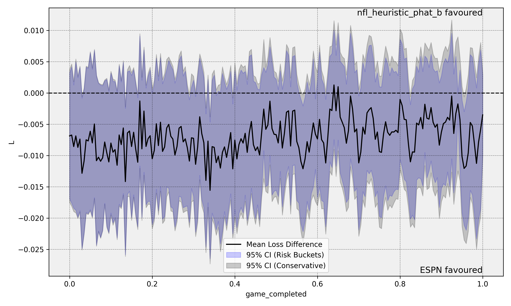
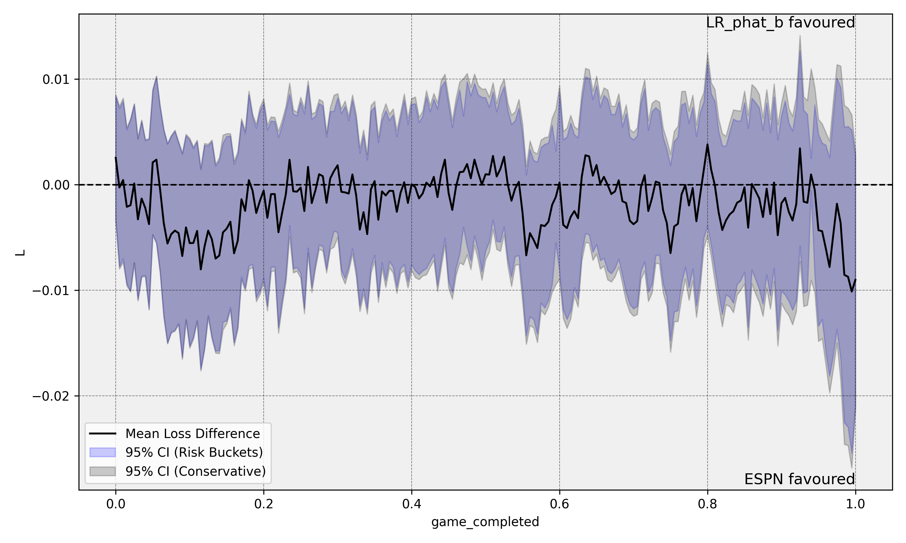
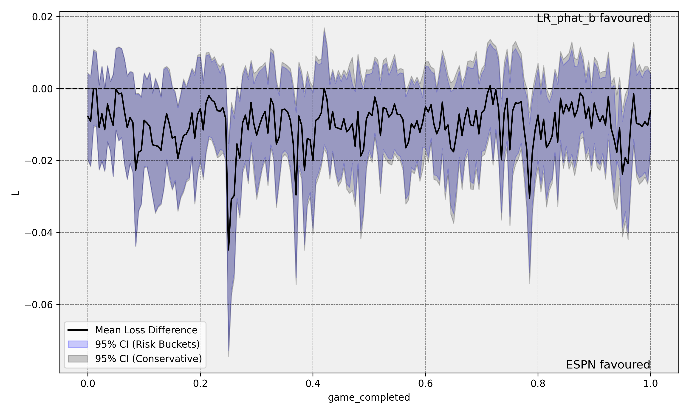

# Testing Model Equivalence and Superiority for Continuously Updated Probabilistic Forecasts

**Aly Shariff, Rohit Gajendragadkar, Jeffrey Negrea, Gregory Rice**

---

## Overview

This repository implements a statistical framework for **testing whether two continuously updated probabilistic forecasts are equivalent or whether one is superior to the other**. The core idea: given two competing forecast sequences $\hat{p}^A_i(t)$ and $\hat{p}^B_i(t)$ over $n$ games (or events), each evaluated at a continuous intra-game time $t \in [0, 1]$, we construct a test statistic based on the supremum of the normalized pointwise loss difference process

$$T_n = \sup_{t \in [0,1]} \left| \sqrt{n}\, \hat{\Delta}_n(t) \right|$$

and derive its asymptotic null distribution via a Gaussian process limit, from which a $p$-value is computed by simulation.

The framework is validated on NFL in-game win probability forecasting, where trained ML models are benchmarked against ESPN's real-time forecasts.

---

## Repository Structure

```
.
├── evalCUPF/                   # Core statistical testing framework
│   ├── entries.py              # Data container for forecast pairs
│   ├── C_estimator.py          # Covariance matrix estimation
│   ├── calculate_p_val.py      # Test statistic and p-value computation
│   ├── risk_buckets.py         # Risk-bucket-based covariance estimation
│   ├── plot_results.py         # Pointwise confidence band plots
│   └── NFL_example/            # End-to-end NFL application
│       ├── run_NFL.py          # Main runner script
│       ├── nfl_heuristic_bucketer.py  # NFL-specific heuristic bucketing
│       ├── nfl_bucketer.py     # K-means bucketing for NFL
│       └── combine_data.py     # Aggregates per-game CSV outputs
│
├── NFL/
│   ├── ML/
│   │   ├── notebooks/          # Jupyter notebooks for each model
│   │   ├── models/             # Reusable model classes
│   │   │   ├── Model.py        # Abstract base (preprocessing, calibration, Optuna HPO)
│   │   │   ├── xg_boost.py     # LightGBM (gradient boosted trees)
│   │   │   ├── logistic_regression.py
│   │   │   ├── direct_prediction_network.py        # Feedforward NN
│   │   │   ├── direct_prediction_network_lstm.py   # LSTM
│   │   │   ├── direct_prediction_network_transformer.py
│   │   │   ├── nfl_heuristic_bucket.py
│   │   │   └── kmeans_bucket.py
│   │   └── data_preprocessing/ # Feature engineering, interpolation, web scraping
│   └── test_8/                 # Results and plots from latest experiment run
│
├── requirements.txt
└── README.md
```

---

## The Statistical Framework (`evalCUPF`)

### Problem Setup

Let $i$ index events (games) and $t \in [0, 1]$ denote normalized event progress. Two forecasters produce $\hat{p}^A_i(t)$ and $\hat{p}^B_i(t)$, and we observe binary outcomes $Y_i$. The pointwise average loss difference is

$$\hat{\Delta}_n(t) = \frac{1}{n} \sum_{i=1}^n \left[ L(Y_i, \hat{p}^A_i(t)) - L(Y_i, \hat{p}^B_i(t)) \right]$$

where $L$ is the Brier score (mean squared error) by default. Negative values favor model $A$; positive values favor model $B$. The null hypothesis is $\mathcal{H}_0: \sup_{t} |\Delta_n(t)| = 0$.

### Asymptotic Theory

Under $\mathcal{H}_0$, the scaled process $\sqrt{n}\,\hat{\Delta}_n(\cdot)$ converges weakly to a mean-zero Gaussian process $\Gamma$ with covariance kernel

$$C(t, s) = \lim_{n\to\infty} \frac{4}{n} \sum_{i=1}^n (\hat{p}^A_i(t) - \hat{p}^B_i(t))(\hat{p}^A_i(s) - \hat{p}^B_i(s))\, p_i(t \vee s)(1 - p_i(t \vee s))$$

A $p$-value is obtained by simulating $B = 10{,}000$ realizations of $\sup_t |\Gamma(t)|$ and computing the fraction exceeding $T_n$.

### Covariance Estimation

Two estimators of $C$ are provided and compared side-by-side in all plots:

| Method | Description |
|--------|-------------|
| **Risk Buckets** | Stratifies game states into risk groups and estimates $p(1-p)$ empirically per bucket. Two variants: K-means (`NFLBucketer`) and a phase-aware heuristics approach (`NFLHeuristicBucketer`). |
| **Conservative** | Replaces $p(1-p)$ with its maximum $\frac{1}{4}$, yielding wider but assumption-free confidence bands. |

### Key Modules

- [**`entries.py`**](evalCUPF/entries.py) — `Entries` class: loads paired forecast DataFrames into aligned $(n \times T)$ arrays for $\hat{p}^A$, $\hat{p}^B$, and $Y$.
- [**`C_estimator.py`**](evalCUPF/C_estimator.py) — `estimate_C(entries, p_est)`: returns the $(T \times T)$ covariance matrix. Pass `p_est=None` for the conservative estimate.
- [**`calculate_p_val.py`**](evalCUPF/calculate_p_val.py) — `calculate_p_val(entries, p_est, B)`: computes $T_n$ and the simulation-based $p$-value. Uses Cholesky decomposition with eigendecomposition fallback for numerical stability.
- [**`risk_buckets.py`**](evalCUPF/risk_buckets.py) — `create_buckets(train_dfs, features, num_bucketers, BucketerClass, ...)`: builds a `BucketContainer` mapping game-state features at each timestep to empirical $\hat{p}(1-\hat{p})$ estimates.
- [**`plot_results.py`**](evalCUPF/plot_results.py) — `plot_pcb(df_stats, ...)`: plots the mean loss difference with pointwise 95% confidence bands for both covariance estimators.

---

## NFL Application

### Forecasting Task

We predict in-game win probability for the home team across NFL games from 2016–2024. The game is discretized into $\Delta t = 0.005$ intervals (201 timesteps over $[0, 1]$). A separate model is trained for each timestep on 2016–2022 seasons, validated on 2023, and tested on 2024. Overtime periods are excluded.

### Features

| Feature | Description |
|---------|-------------|
| `score_difference` | Home score minus away score |
| `timestep` | Normalized game progress $\in [0, 1]$ |
| `home_has_possession` | Boolean |
| `type.id` | Play type identifier |
| `relative_strength` | ESPN pre-game probability (ELO proxy) |
| `end.down` | Down number (1–4) |
| `end.yardsToEndzone` | Yards to opponent's end zone |
| `end.distance` | Yards to first down |
| `field_position_shift` | Change in field position during the play |
| `home_timeouts_left` | Home team timeouts remaining |
| `away_timeouts_left` | Away team timeouts remaining |

Play-by-play events are converted to a uniform time grid via last-observation-carried-forward interpolation: for each timestep $t_k$, the feature vector is taken from the most recent play with $g_{i,j} \leq t_k$.

### Models

All models use Bayesian hyperparameter optimization (Optuna) and isotonic regression calibration. A separate model instance is trained per timestep.

| Model | Type | Loss(es) |
|-------|------|----------|
| Logistic Regression | Static | BCE |
| Random Forest | Static | BCE, MSE |
| Gradient Boosted Trees (LightGBM) | Static | BCE, MSE |
| Feedforward Neural Network | Static | BCE, MSE |
| LSTM | Sequential | BCE, MSE |
| GRU | Sequential | BCE, MSE |
| Transformer Encoder | Sequential | BCE, MSE |

### Results

Each plot shows the pointwise mean loss difference $\hat{\Delta}_n(t)$ (black line) with 95% confidence bands across normalized game time: **blue** for risk-bucket-based covariance, **gray** for conservative. Regions where the band does not cross zero indicate statistically significant forecast differences.

**XGBoost vs ESPN**


**Logistic Regression vs ESPN**


**Neural Network vs ESPN**


---

## Getting Started

### 1. Clone and Set Up the Environment

```bash
git clone <repo-url>
cd <repo-root>

python -m venv env
source env/bin/activate       # Windows: env\Scripts\activate

pip install -r requirements.txt
```

### 2. Set the Python Path

Since there is no installed package yet, add the repo root to your Python path so imports resolve correctly:

```bash
export PYTHONPATH=$(pwd)       # Windows: set PYTHONPATH=%cd%
```

Or add it permanently in your shell profile / `.env` file.

### 3. Running the NFL Functional Test

The entry point is [**`evalCUPF/NFL_example/run_NFL.py`**](evalCUPF/NFL_example/run_NFL.py). It:

1. Loads per-game training CSVs to build risk buckets.
2. Loads a combined forecast CSV (`game_id`, `game_completed`, `phat_A`, `phat_B`, `Y`).
3. Assigns each test game-state to a risk bucket and estimates $\hat{p}(1-\hat{p})$.
4. Computes the $p$-value and generates the pointwise confidence band plot.

```python
from evalCUPF.NFL_example.run_NFL import run_test
from evalCUPF.NFL_example.combine_data import combine_csv_files

# Step 1: aggregate per-game model prediction CSVs into a single file
combine_csv_files("xgboost_model", "NFL/test_8")

# Step 2: run the functional equivalence test
p_val = run_test(
    dir="NFL/ML/dataset_interpolated_fixed",   # root with per-year subdirectories
    train_years=[2021, 2022, 2023],             # seasons used to build risk buckets
    test_years=[2024, 2025],                    # seasons to evaluate
    forecast_file="NFL/test_8/xgboost_model_combined_data.csv",
    features=[
        "score_difference", "relative_strength",
        "end.yardsToEndzone", "end.down", "end.distance"
    ],
    num_bucketers=50,    # number of timestep bucket intervals
    num_buckets=5,       # sub-buckets per interval
    B=10000,             # Monte Carlo draws for p-value
    phat_A="ESPN",
    phat_B="nfl_heuristic_phat_b",
    save_plot="NFL/test_8/plot_ESPN_xgboost_model.png",
)
print(f"p-value: {p_val:.4f}")
```

Or run directly:

```bash
python -m evalCUPF.NFL_example.run_NFL
```

### 4. Using the Framework on Your Own Data

Prepare a forecast CSV with these columns:

| Column | Type | Description |
|--------|------|-------------|
| `game_id` | str/int | Unique event identifier |
| `game_completed` | float | Timestep $t \in [0, 1]$ (e.g., steps of 0.005) |
| `phat_A` | float | Model A probability forecast |
| `phat_B` | float | Model B probability forecast |
| `Y` | int | Binary outcome (0 or 1) |

**Minimal example — conservative covariance (no auxiliary data needed):**

```python
import pandas as pd
from evalCUPF.entries import Entries
from evalCUPF.calculate_p_val import calculate_p_val
from evalCUPF.C_estimator import estimate_C
from evalCUPF.plot_results import plot_pcb, calc_L_s2

df = pd.read_csv("your_forecasts.csv")

entries = Entries(timestep_size=0.005)
entries.load_entries(df, "game_completed", "phat_A", "phat_B", id_field="game_id")

# p_est=None uses the conservative estimator (p(1-p) = 1/4)
p_val = calculate_p_val(entries, p_est=None, B=10000)
print(f"p-value: {p_val:.4f}")

# Plot pointwise confidence bands
C_cons = estimate_C(entries, p_est=None)
df_stats = calc_L_s2(df, C_cons, C_cons,
                     pA="phat_A", pB="phat_B", Y="Y", grid="game_completed")
plot_pcb(df_stats, grid="game_completed", L="L",
         var_C1="sigma2_C1", var_C2="sigma2_C2",
         phat_A="Model A", phat_B="Model B",
         save_plot="output_plot.png")
```

**With risk-bucket covariance** — provide a `p_est` array of shape `(n_games, n_timesteps)` containing empirical $\hat{p}(1-\hat{p})$ values, built via `create_buckets` and `BucketContainer.assign_bucket` (see [NFL_example/run_NFL.py](evalCUPF/NFL_example/run_NFL.py) for a complete example).

---

## Dependencies

Core libraries (see `requirements.txt` for pinned versions):

| Category | Libraries |
|----------|-----------|
| ML | `scikit-learn`, `lightgbm`, `xgboost`, `catboost`, `torch`, `tensorflow` |
| HPO | `optuna` |
| Data | `pandas`, `numpy`, `scipy` |
| Visualization | `matplotlib`, `seaborn` |
| Interpretability | `shap` |

---

## Citation

> Shariff, A., Gajendragadkar, R., Negrea, J., & Rice, G. (2025). *Testing model equivalence and model superiority for continuously updated probabilistic forecasts.* University of Waterloo.